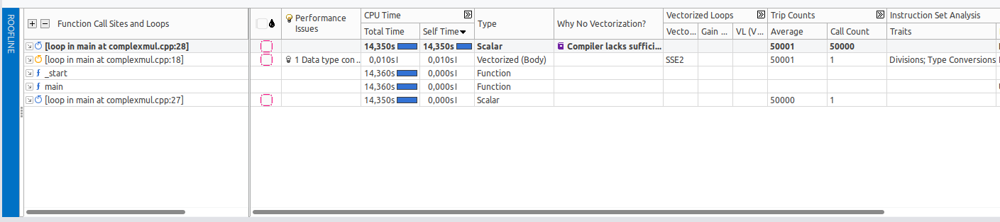
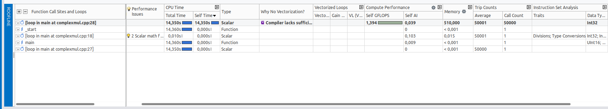

# Tarea 1: Intel Advisor

## Preguntas
* En la vista de "Survey & Roofline" se hace referencia a Total time y self-time. ¿Qué diferencia hay entre ambas?
  ### Diferencia entre Total time y self-time
  
    -> Total-time: Es el tiempo que tarda una función un bucle en ejecutarse. Este, incluye el tiempo de ejecución de todas las función y bucles que llama
  
    -> Self-time: Es el tiempo que tarda una función un bucle en ejecutarse. Este, Excluye el tiempo de ejecución de todas las función y bucles que llama
----------------------------------------------------------------------------------------------------------------------------------------------------------------------
* Realiza un análisis de tipo Survey, accede a  la pestaña "Survey & Roofline" y haz una captura de la información (se usará
más tarde).
  ### Analisis tipo survey
  
* Pulsa sobre roofline (dentro de Survey & Roofline) y comprueba que no aparece ningún gráfico. ¿A qué se debe?

    -> Esto es ocasionado, ya que los datos de la línea del techo no están disponibles. Ya que el informe de la línea de techo depende de los datos de operaciones de punto flotante y enteros. Para poder trabajar y recoger dichos datos, es necesario seleccionar y ejecutar el analisis FLOP en el cuadro de trabajo de la izquierda, marcando las dos casiilas
-----------------------------------------------------------------------------
* Haz un análisis de trip-counts y flop. ¿Qué información nueva aparece en la vista de survey? Haz una captura y comenta
los datos nuevos más relevantes.

Al ejecutar de esta nueva forma con Advisor-Gui optenemos 3 nuevas columnas:

    -> Memory: Muestra el tráfico de la memoria

    -> Trip Counts: Nos indica el número de veces que se ejecuta el bucle

    -> Compute Performance: Nos presenta las estadísticas para el uso de máscara FLOPS

-----------------

# Task 1: Intel Advisor

## Questions
* Within the "Survey & Roofline" view, references are made to both Total time and Self-time. What is the difference between these two terms?
* Conduct a Survey analysis, navigate to the "Survey & Roofline" tab, and capture the information displayed (this will be used later).
* Click on the roofline within the "Survey & Roofline" and observe that no chart appears. What could be the reason for this absence?
* Perform an analysis focusing on trip-counts and FLOP (Floating Point Operations). What new information is presented in the survey view? Capture this information and discuss the most pertinent new data.

