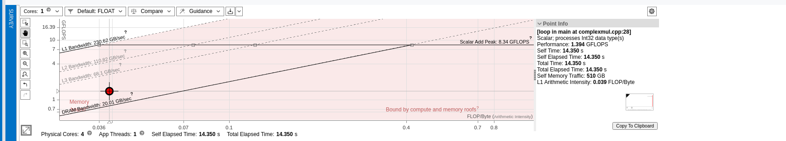

# Tarea 2: Roofline
## Preguntas
1. Genera un roofline y analiza la información representada. Copia una captura del roofline en la respuesta
para apoyar tu análisis. Finalmente genera un snapshot con el nombre "task2" y añádelo a esta misma carpeta.

    -> Un Roofline es una característica que nos permite modelar la línea de techo del rendimiento en función de su intensidad aritmética.Esta se representa a través de un gráfico, siendo X la intensidad e Y el rendimiento

    -

    -> Como podemos apreciar en la Captura de pantalla adjuntada, Comprobamos como tenemos 3 zonas distintas:

        ->Zona Clara: Donde el rendimeinto se encuentra limitado por el ancho de banda. Es decir si nuestro código está por aquí, nuestra CPU puede generar más datos que la memoria puede proporcionarlos

        -> Zona oscura: Es donde el rendimiento se encuentra limitado por la capacidad de procesamiento de la CPU

        -> Zona Intermedia: Indica una zona en la que la memoria y la CPU intervienen en el rendimiento

    -> Apreciamos como nuestro punto rojo se encuentraen zona clara, es decir está limitado por memoria, teniendo una intensidad bastante baja de 0,039 FLOPS. Con esto podemos supones que nuestro código traslada muchos datos desde la memoria, pero con pocas operaciones aritméticas, suponiendo un satuaración en memoria antes de aprovechar la CPU.

    -> También observamos como la línea del rendimiento máximo se encuentra cerca del punto rojo, por lo que podemos deducir que el rendimiento esta siendo limitado por memoria

----------
2. ¿Por qué está limitado el algoritmo? ¿Qué técnicas podríamos aplicar para mejorar el rendimiento?

    -> Como hemos mencionado anteriormente, nuestro algoritmo esta siendo limitado por memoria, para solucionar este problema, podemos vectorizar nuestro bucle para solucionar y mejorar ese rendimiento

----

# Task2: Roofline
1. Generate a roofline and analyze the information depicted. Copy a screenshot of the roofline in your response to support your analysis. Finally, create a snapshot with the name "task2" and add it to this same folder.
2. Why is the algorithm limited? What techniques could we apply to improve performance?
