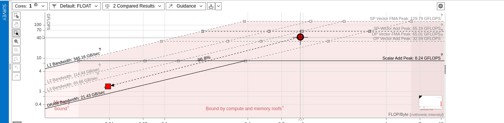

# Tarea 4: Análisis de memoria y mejora vectorización

## Preguntas

* Compila de nuevo el programa complexmul.cpp **sin vectorizar** y genera un análisis de memoria marcando los bucles del cómputo que realizan la mutliplicación de números complejos, en concreto marca los bucles de las líneas 27 y 28 (si el análisis se demora mucho prueba a reducir el tamaño). Realiza el análisis tanto usando la interfaz gráfica de intel advisor como por línea de comandos. Además indica que comando es el que has usado para realizar el análisis por comando.

* Abre advisor y selecciona la vista "Refinement Reports".
    * ¿Qué información nos proporciona esta vista? enumera cada elemento de la tabla resumiendo el significado

      -> Site Location (Localización del Sitio)

      -> Loop-Carried Dependencies (Dependencias de Bucle): Informa de la presencia/ausencia de dependencias entre disitntas iteracciones

      -> Strides Distribution (Distribución de Strides): Manera en la que se accede a los elementos

      -> Access Pattern (Patrón de Acceso): Indica como un programa accede a los datos de memoria

      -> Footprint Estimate (Estimación de Huella): Cantidad de recursos que utiliza el código/programa

      -> Site Name (Nombre del Sitio): Nombre del programa
      
      -> Performance Issues (Problemas de Rendimiento): Dificultades de eficiencia y velocidad del programa

      -> Cache Line Utilization (Utilización de la Línea de Caché): Mide la efectividad de las líneas cache
      
      -> Memory Loads (Cargas de Memoria): Escritura en memoria desde memoria hacia registros

      -> Memory Stores (Almacenes de Memoria): Escritura en memoria desde registros hacia memoria

      -> Cache Misses (Fallos de Caché): Numero de cargas que se han hecho en un alto nivel

      -> RFo Cache Misses (Fallos de Caché RFo): Lineas de cache que han sido cargadas por escritura

      -> Dirty Evictions (Desalojo Sucio): Una línea de cache debe de quitarse para meter nuevos datos

------------------------

    * ¿Qué comportamiento de memoria se obtiene? ¿Por qué es deseable tener un stride uniforme?

        -> Accedemos de forma uniforme a possciones de memoria como i,j,a,b y c. Pero los accesos se realizan de 2 en 2 en los casos de a, b y c

        -> Debemos de tener un stride uniforme, ya que de esa forma somos capaces de saber donde realizaremos el siguiente acceso a memoria. Por lo que podriamos evitarnos fallos como acceder a la misma posición de memoria.

-----------
    * Mira el resultado del análisis de memoria de ambos bucles y comprueba que el stride es de 2.
        * ¿Por qué el stride tiene este valor? (Revisa los conceptos de row-order y column-order así como el orden en el que se reserva la memoria en C)

          -> En primer lugar tenemos que saber que es row-order(fila por fila, pero antes en memoria) y column-order(columna por columna), los cuales indican la forma de recorrer una matriz bidimensional

          ->Conociendo estos dos conceptos, podemos decir que si accedemos a un stride de 2, estaremos accedirendo a los elementos de la misma fila, pero saltando un elemento de acceso

        * ¿Sobre que variables se está accediendo con un stride de 2? ¿Cómo afecta esto a la caché?

          ->Este esta afectando sobre los dos bucles, aunque vemos como a el que más afecta es a el segundo.

          -> Esto afecta a cache de tal forma que se divida el tiempo por culpa de los fallos, en contrario que si avanzamos una posición por cada iteracción

        * ¿Se te ocurre algún modo de modificar el programa, manteniendo los dos bucles y el mismo resultado, para que
        el acceso a la variable sea uniforme? Realiza la modificación y almacena el resultado en esta misma carpeta con el nombre complexmul_unit_stride.cpp.

          -> para modificar este código he modificado las letras de los bulces modificando en el primer bucle que anteriormente tenia la letra i ahora tiene la j, y la que tenia la j ahora tiene la letra i. Lo que nos esta ayudando a que iteremos sobre el bucle superior, mejorando el acceso a memoria
 ------------------------
* Genera un snapshot para el análisis completo (hasta los patrones de acceso a memoria) tanto para la versión con un stride de 2 como para la versión con stride unitario (ambos vectorizando el código) y llámalos respectivamente "task4a" y "task4b", añádelos a esta misma carpeta. 

    * En "task4b" ¿Cuáles son los valores de la longitud del vector y la ganancia estimada? ¿Son los resultados que se esperaban? Justifica la respuesta.

        -> Al mostrar el resultado de la longitud del vector, vemos como solamente aparece el valor 8.

        -> La ganancia, no es mostrada debido al mismo error que se indicaba anteriormente en otro ejercicio

    * Comparando estas dos soluciones ¿Cuánto ha aumentado la ganancia?

        -> Dado que ninguna de las dos soluciones me muestra la ganancia no es posible realizar esta comparación

* Compara los resultados del análisis task2 y task4b:
    * ¿Cuál ha sido la ganancia real del algoritmo vectorizado? ¿Ha sido menor o mayor a la estimación?
    

    -> Apreciammos en la captura de pantalla como el punto de task2, se encuentra mucho más abajo y a la izauierda, lo que supone que dicho código es menos eficiente o tener un peor rendimiento que task4b que se encuentra en una posición mejor(Arriba a la derecha)
  
-----

# Task 4: Memory Analysis and Vectorization improvement

## Questions:

* Recompile the complexmul.cpp program without vectorization and generate a memory analysis, highlighting the computation loops that perform the multiplication of complex numbers. Specifically, mark the loops on lines 27 and 28 (if the analysis takes too long, consider reducing the size). Conduct the analysis using both the Intel Advisor graphical interface and the command line. Also, specify the command you used for the command-line analysis.

* Open Advisor and select the "Refinement Reports" view.

  * What information does this view provide? List each item in the table, summarizing its meaning.
  * What memory behavior is observed? Why is it desirable to have a uniform stride?
  * Examine the memory analysis results for both loops and confirm that the stride is 2.
  * Why is the stride value set at this level? (Review the concepts of row-order and column-order, as well as the order in which memory is allocated in C).
  * Which variables are being accessed with a stride of 2? How does this affect the cache?
  * Can you think of a way to modify the program, keeping the two loops and the same outcome, so that variable access is uniform? Implement the change and save the result in this same folder with the name complexmul_unit_stride.cpp.
* Generate a snapshot for the complete analysis (up to memory access patterns) for both the version with a stride of 2 and the version with a unitary stride (both vectorizing the code). Name them "task4a" and "task4b", respectively, and add them to this same folder.

  * In "task4b," what are the values for vector length and the estimated gain? Are these the expected results? Justify your answer.
  * Comparing these two solutions, by how much has the gain increased?
* Compare the analysis results of task2 and task4b:
  * What was the actual gain from the vectorized algorithm? Was it less or more than the estimate?
