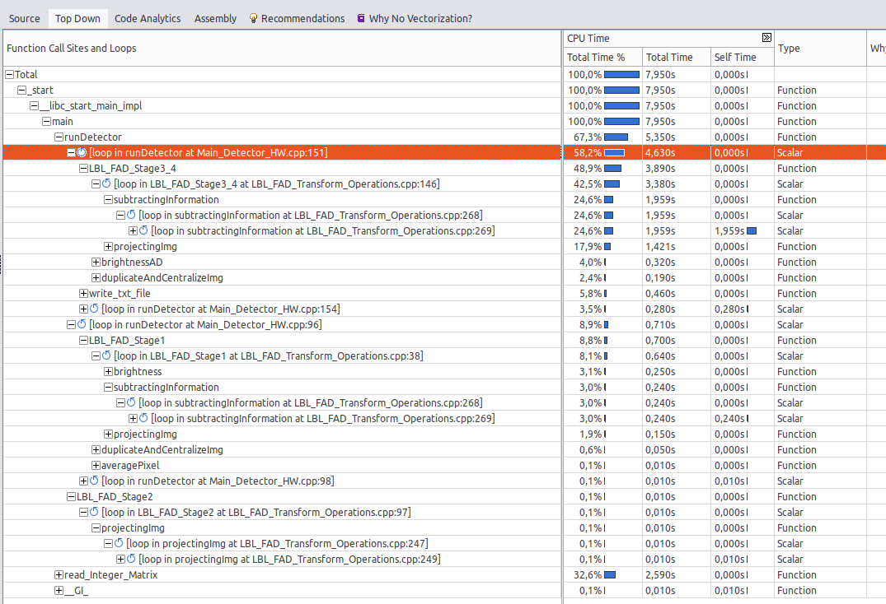
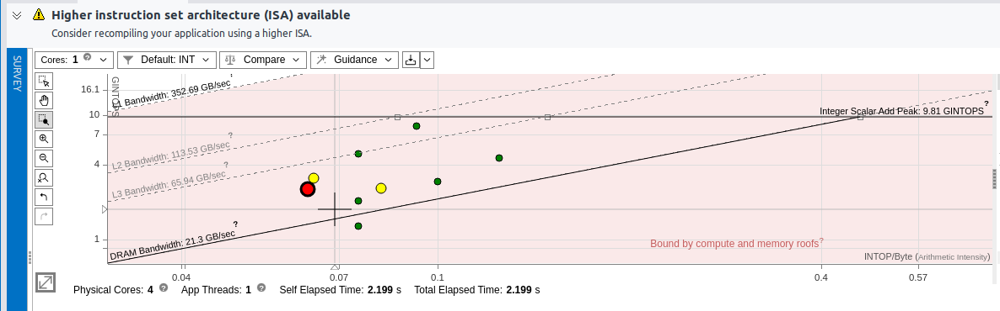
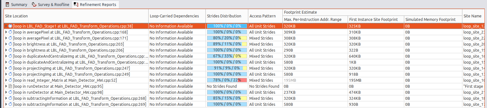
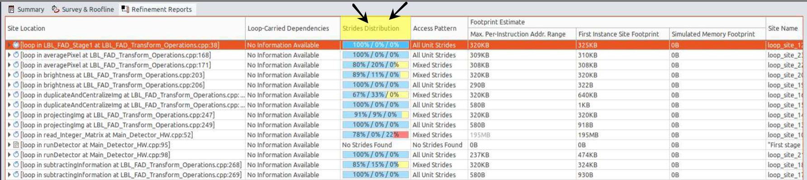

## RESPUESTAS (LBL_FAD)
* Antes de comenzar a realizar ningún análisis sobre el código es interesante conocer las características de la arquitectura sobre la que estás ejecutando el programa, para ello contesta a las siguientes preguntas:

    * Indica tu modelo de procesador, la arquitectura y de cuantos núcleos e hilos de procesamiento dispones

        -> Para mostrar el modelo de nuestro porcesador, la arquitectura y de cuantos núcleos e hilos de porcesamiento dispongo en mi equipo, procedemos a ejecutar el comando en la terminal 'lscpu', listando la arquitectura de nuestro dispositivo.

        ## Información General
            ->  **Arquitectura**: `x86_64` — La CPU utiliza una arquitectura de 64 bits compatible con 32 bits.

            ->  **Modo(s) de operación de las CPUs**: `32-bit, 64-bit` — Puede operar tanto en 32 bits como en 64 bits.

            ->  **Address sizes**: `39 bits físicos, 48 bits virtuales` — La CPU maneja 39 bits para direcciones físicas y 48 bits para direcciones virtuales.

            ->  **Orden de los bytes**: `Little Endian` — La CPU utiliza el orden "little endian", donde el byte menos significativo se almacena primero.

        ## Núcleos y Procesadores Lógicos
            ->  **CPU(s)**: `8` — El sistema tiene 8 procesadores lógicos (o hilos de procesamiento).

            ->  **Lista de la(s) CPU(s) en línea**: `0-7` — Todos los procesadores (0 a 7) están activos.

            ->  **Hilo(s) de procesamiento por núcleo**: `2` — Cada núcleo físico tiene 2 hilos (indicando que hay hyper-threading).

            ->  **Núcleo(s) por socket**: `4` — Cada socket físico de CPU tiene 4 núcleos.

            ->  **Socket(s)**: `1` — La máquina tiene una CPU física o un socket.

            ->  **CPU MHz máx. y mín.**: `4500 MHz` y `800 MHz` — La frecuencia de la CPU varía entre 800 MHz (mínima) y 4500 MHz (máxima).

            ->  **BogoMIPS**: `4999.90` — Una medida aproximada del rendimiento de la CPU, utilizada principalmente por el kernel de Linux.

        ### Información del Modelo
            ->  **modelo**: `Intel(R) Core(TM) i5-10300H CPU @ 2.50GHz` — Es un procesador Intel Core i5 de décima generación.

        ### Virtualización
            ->  **Virtualización**: `VT-x` — La CPU soporta virtualización de hardware con la tecnología VT-x de Intel, que permite la creación de máquinas virtuales con un rendimiento mejorado.

        ### Cachés de la CPU
            ->  **L1d**: `128 KiB (4 instancias)` — Caché de nivel 1 para datos, con un total de 128 KiB.

            ->  **L1i**: `128 KiB (4 instancias)` — Caché de nivel 1 para instrucciones, también de 128 KiB en total.

            ->  **L2**: `1 MiB (4 instancias)` — Caché de nivel 2 con un total de 1 MiB.

            ->  **L3**: `8 MiB (1 instancia)` — Caché de nivel 3, compartida entre todos los núcleos, con un total de 8 MiB.

    * ¿Cuantos hilos pueden ser ejecutados por núcleo?

            -> Para nuesto ordenador, podriamos ejecutar 2 hilos a la vez, dado que en la informacion de nucleos y Procesadores lógicos nos indica la cantidad de hilos

----------        

* Realiza un análisis completo desde la vista de CPU/Roofline. Desde la pestaña de "Survey & Roofline" analiza el resultado Top Down.

 * ¿Qué función de nuestra lógica de negocio consume más tiempo?

        -> La función que mas tiempo de CPU consume se encuentra en la línea 151, en concreto run Detector, representando un 58,2% del tiempo total 

 * ¿Qué etapas son las más costosas?

        -> Comprobamos como el propio nombre 'top Down' en 'Rofline' nos indica que las más costosas se situaran más cerca al borde superior de la tabla mostrada, por lo que enumeramos de mayor a menos coste:

        1.- LBL_FAD_Stage3_4: Si nos adentramos dentro de dicha función vemos como cuenta con dos bucles, los cuales son:

             -SusbtractigInformation:
                -Loop in substractingInformation at LBL_FAD_Transform_Operatios.cpp:268, con un consumo de tiempo de 23,9%

                -ProjectingIMG
                    -Loop in ProjectingIMG at LBL_FAD_Transform_Operatios.cpp:247, con un consumo de timepo de 17,5%
------

        2.- LBL_FAD_Stage1: Si nos adentramos dentro de dicha función vemos como cuenta con dos bucles, los cuales son:

                -ProjectingIMG
                    -Loop in ProjectingIMG at LBL_FAD_Transform_Operatios.cpp:247, con un consumo de timepo de 2,9%

                -SusbtractigInformation:
                    -Loop in substractingInformation at LBL_FAD_Transform_Operatios.cpp:268, con un consumo de tiempo de 2,7%
------------

        3.- LBL_FAD_Stage2: Si nos adentramos dentro de dicha función vemos como cuenta con dos bucles, los cuales son:

                -SusbtractigInformation:
                    -Loop in substractingInformation at LBL_FAD_Transform_Operatios.cpp:268, con un consumo de tiempo de 0,2%

                -ProjectingIMG
                    -Loop in substractingInformation at LBL_FAD_Transform_Operatios.cpp:247, con un consumo de timepo de 0,1%

    * ¿Qué operaciones (entendemos operaciones como las funciones definidas en LBL_FAD_Transform_Operations.h/.cpp) son las más complejas y requieren de un mayor tiempo?

        -> SubtractingInformation: Lineas 268 y 269, ocupando un tiempo total de CPU de 24,6%

        -> projectingInm: Líneas 247 y 249, ocupando un 17,9& del tiempo total de CPU

-------------

Realiza un análisis completo y muestra una captura de pantalla del gráfico roofline.

En primer lugar identificaremos los colores de los puntos marcados en el gráfico, siendo el rojo, que significa que el ancho de banda de memoria, el amarillo, significa que se enceuntra parcialmente limitado por el calculo y el acceso a memoria; El punto verde, significa que esta optimizado o limitado por el cálculo

* ¿Cuáles son los tres bucles más complejos? ¿Por qué están limitados? ¿Cómo los mejorarías?
    Los 3 bucles más complejos son el punto rojo y los dos puntos amarillos, para ello los explicamos

    -> Punto rojo: Bucle del Stage 3, método substractingInformation, en línea 269, se encuentra limitado por el ancho de banda de memoria, por CPU, en la cual si aumenta hacia la derecha, mejorará la intensidad aritmética. Podemos solucionarlo, utilizando vectorización o reduciendo los accesos a memoria intermedios

    -> Punto amarillo 1 (Más cercano a punto rojo): Bucle del Stage 3, método projectingImg, en línea 249, se encuentra limitado por memoria, por CPU. Podemos solucionarlo, utilizando paralelizacion o reorganizando los datos

    -> Punto amarillo 2 (Más lejano a punto rojo): Bucle del Stage 3, método brightnessAD , en línea 309, se encuentra limitado por GPU. Podemos solucionarlo, utilizando paralelizacion o reorganizando los datos

Finalmente resulta interesante ver el patron de acceso de memoria que se realiza en el código con el objetivo de valorar la vectorización o mejorar los accesos a memoria para hacer un mejor uso de la jerarquía de memoria.

Realiza un análisis de tipo "refinement" añadiendo el paso de Memory Access Patterns y selecciona los dos bucles que más tiempo
consumen realizando cálculos internos.

        -> Tras realizar un analisis sobre 'Memory Access Patterns' y meternos en la pestaña superior a Refinement Reports nos muestra un informe sobre como se están utilizando los recursos de memoria. En ese informe nos mostrará varias columnas más significativas para estas cuestiones:

            -Columna 'Site Location': Muestra la ubicación del bucle en nuestro código
            -Columna 'Loop-Carried Dependencies': Indica si existen dependencias de Iteración en el bucle
            -Columna 'Footprint Estimate': Refleja en varias columnas el uso de la memoria
            -columna 'Access Pattern': Indica el tipo de acceso a memoria que realiza el bucle
            -Columna 'Strides Distribution': Muestra la distribución de los acceos a memoria en el bucle

    En esta Captura de pantalla mostramos el consumo de memoria de todos los bucles, paara realizar las siguientes cuestiones, seleccionaremos los dos bucles que más tiempo consumen.

* Indica que dos bucles son

        -> Para obtener dicha información sobre cuales son los dos bucles que más tiempo consumen, podemos decir que son estos dos:

            - Loop in subtractingInformation at LBL_FAD_Transform_Operations.cpp:267

            -Loop in duplicateAndCentralizeImg at LBL_FAD_Transform_Operations.cpp:185

        * Estos dos bucles, cuentan con los valores más altos de 'Footprint Estimate', el cual nos indca que son los que más tiempo consumen, debido a su elevados requisitos de acceso a memoria
* ¿Qué tipos de acceso a memoria se está realizando? ¿cuáles existen?

        -> Tras analizar la Captura de pantalla, vemos como los tipos que aprecen son dos:
            - All Unit Strides: Significa que los accesos a memoria son de forma continua, es decir, el acceso a las ubicaciones de memoria se realizan de forma consecutiva

            - Mixed Strides: Significa que los accesos a memoria no son del todo consecutivos, si no que pueden ser tanto consecutivos como ir por saltos (Strides) a las ubicaciones

        -> Dentro de nuestro conjunto de tipos de acceso a memoria, además de los dos nombrados anteriormente, también algunos otros como son:

            - Strided Access: Realiza Accesos a memoria mediante saltos (Strides)

            - Random Access: Realiza accesos sin un patron definido

            - Gather: Accede a diferentes posciones de memoria de forma no contigua

Para cada pregunta analiza y aporta las capturas de pantalla que veas conveniente para apoyar la explicación.

----