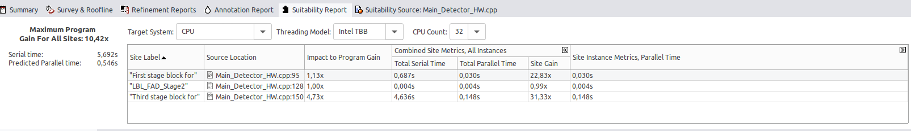
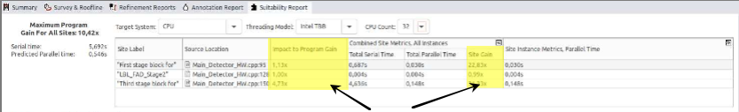
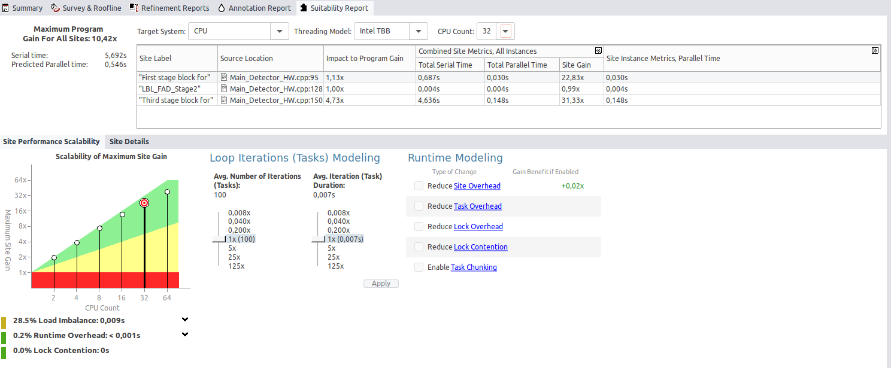
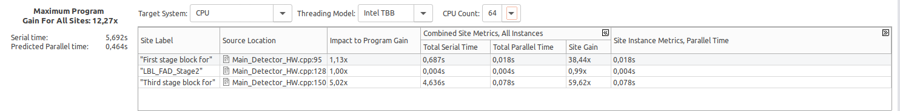
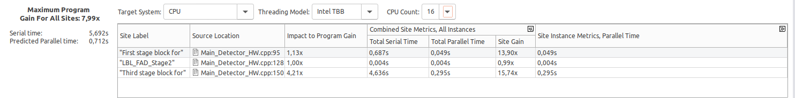

# Tarea 2: Anotación y análisis de tipo threading RESPUESTAS

* ¿Qué bucles se han anotado?

    Tras realizar un analisis 'Suitability' de nuestro ejecutable, nos vamos a la pestaña Suitability, en la que encontraremos dicha información

    

        -> First Stage block for.
        *Location: Main_Detector_HW.cpp:95

         -> LBL_FAD_Stage2.
        *Location: Main_Detector_HW.cpp:128

        -> Thirs stage block for
        *Location: Main_Detector_HW.cpp:150

    *Estos tres son las tres anotaciones que aperecen una vez realizado el análisis, por ello adjunto una captura, para mantener una justificación de lo encontrado y poder analizar los resultados.

* ¿Qué estructura sigue una anotación? ¿En qué partes se descomponen?

    -> Una anotación esta compuesta de una estructura, la cual, está formada por:

            * Inicio de la anotación: Indica el comienzo de una sección que se va a anotar
            * Cuerpo de la Tarea: En esta sección, encontramos el código que se va a ejecutar con esa anotación
            * Fin de la anotación:  Indica el fin de la sección anotada
     * Aquí abajo Muestro una captura de un fragmento de nuestro código  en la que se muestra la estructura que hemos definido anteriormente en nuestras RESPUESTAS.md
        

* Las anotaciones son como un pseudocódigo de cómo paralelizaríamos con OpenMP. ¿A qué equivale en OpenMP cada una de las partes de la anotación?

    -> Buscamos las diferentes anotaciones, y posteriormete analizamos a que paralelización de OpenMP se asemejan

        * ANNOTATE_SITE_BEGIN/ANNOTATE_SITE_END: Equivale al pragma '#Pragma omp parallel', esto se debe a que este crea un 'trozo' de código en el que varias instancias pueden ejecutarse en diferentes hilos

        * ANNOTATE_ITERATION_TASK: Equivale al pragma' #pragma omp for', dado que está indicando que las iteraciones de un bucle debe de dividirse entre los diferentes hilos disponibles.

        * ANNOTATE_TASK_BEGIN/ANNOTATE_TASK_END: Euivale al pragma '#pragma task', Nos esta mostrando que una tarea es capaz de ejecutarse en paralelo y en cualquier momento, sin necesidad de esperar a que otras tareas se completen

Una vez ejecutado el análisis de tipo "Suitability" accede a la pestaña Suitability Report y contesta a las siguientes preguntas:

* ¿Qué significan cada una de las columnas de la tabla superior?

    -> Este tipo de análisis forma una tabla compuesta por 5 columnas:

        -Site Label: Muestra una etiqueta/nombre del fragmento de código analizado

        -Source Location: Indica el archivo y la línea de código donde se encuentra

        -Impact to Program Gain: Indica cuanto podría mejorar el rendimiento global del programa si paralelizamos

        -Combined SIte Metrics, All Instances:
            -Total Serial TIme: Tiempo total en ejecución secuencial, sin paralelizar
            - Total parallel Time: Estimación del tiempo si se paralelizara en multiples hilos
            -Site Gain: Muestra el incremento del rendimeinto que se espera al aplicar la parelelización

        -Site Instance Metrics, Parallel Time: Muestra el tiempo de ejecución paralelo estimado de cada estancia

* ¿Qué diferencia existe entre 'Impact to Program Gain' y 'Site Gain'?

-> La diferencia de ambos dos, esta basada en dondeo y como se mide ese impacto de paralelización, explicación:

        -Impact Program Gain: Mide el impacto de la paralelización en el RENDIMIENTO TOTAL DEL PROGRAMA COMPLETO

        -Site Gain: Mide la mejora de rendimeinto de UN BLOQUE ESPECIFICO al paralelizar
    
    -> En Resumen, la diferencia más notable entre ambos dos, es que Impact Program Gain, se centra en la representación de la parelelización en TODO EL PROGRAMA, mientras que Site Gain, representa la eficiencia de paralelización en una parte/Bloque del programa
    
* ¿Qué bucles paralelizarías? ¿Con qué bucle obtendrías un mayor rendimiento?
    
    -> Para poder seleccionar alguno de los bucles mostrados, tendriamos que ver cual es el que mayor de los valores nombrados anteriormente tiene.

        1.- Third stage block for
                 -Main_Detector_HW.cpp:150: Este seria el mejor candidato a paralelizar, ya que se SIte Gain es superior a el resto (31,33x), a su vez su impacto en la ganacia del sitio es superior (4,73x) a cualquiera de los 3 contando también con un mayor Total Serial Time(4,636s). Indicandonos que su paralelización tendrá un mayor impacto en el rendimiento general del programa

        2.- First stage block for
                -Main_Detector_HW.cpp:95: Este cuenta con un Site Gain Elevado (22,83x) aunque inferior al anterior nombrado, teniendo en cuenta también un impact Program Gain(1,13x) elevado, el cual también ayudaria a mejorar el rendimiento del prgrama aunque en menor media que el anterior
        
        3.- LBL_FAD_Stage2
                - Main_Detector_HW.cpp:128: Este cuenta con una Site Gain (0,99x) demasiado bajo, en concreto el más bajo de los 3, lo cual nos indica que por mucho que intentemos mejorarlo la ganacia va a ser mínima
        
        - Entre los 3 seleccionados podriamos seleccionar 1 para paralelizar y así obtener un mayor rendimiento sería 'Third stage block for' dado que su impacto es mayor, esto se lo demuestra ya que su Ganancia del sitio es superior al resto de los 3, lo que puede dar lugar a una mejora en el rendimiento

* ¿Cómo afecta la duración y número de iteraciones al rendimiento esperado? 

    -> Teniendo en cuenta que la duración y el número de iteraciones afectan al rendiemitno esperado en la paralelización, procedemos a analizarlo:

        -Número de iteraciones al rendimiento: Normalmente, a mayor número de iteraciones la paralelización es más beneficiosa, dado que distribuye en varios hilos, reduciendo el tiempo de ejecución

        -Duración del bucle:Si el tiempo de un bucle es bastante alto, como en el ejemplo que contamos con 4,636s en 'Third stage block for', si lo paralelizamos tendiramos una gran mejora en su tiempo de ejecución 
    
    -> Hemos de tener en cuenta que los bloques de códigoc on menos número de iteraciones, tendrán un menor impacto en rel rendimeinto, ya que el tiempo que ahorramos en la ejecucion es mínimo, comparandolo con los bloques más largos

Utiliza capturas de pantalla para apoyar el análisis
* ¿A qué corresponde el número de iteraciones en cada "site" en el código? ¿Qué explicación tienen dentro del algoritmo?

    -> EL número de Iteraciones en cada 'site' se refiere a cuantas ejecuciones realiza el bucle en ese sitio específico. Dentro de nuestro algoritmo, su explciación puede estar relacionada con el número de iteraciones al procesar la cantidad de datos en cada uno de los bloques

* Para comprobar nuestro código, realizamos un ligero analisis pero con distintos hilos, para ello adjuntamos capturas de tal con la ejecución con niveles de CPU Counts:

    -CPU Counts 64
    

    -CPU Counts 32
    

    -CPU Counts 16
    

    -CPU Counts 8
    

    -> Como vemos al modificar nuestro CPU Counts, podemos obtener distitnos valores, en las columnas, para ello realizaremos un breve análisis de cada uno de ellos Comparandolos con el que hemos realizado el análisis es decir CPU Counts: 32:

        -> CPU Counts 64
            - Comprobamos como los 'Site Gain' Aumentan al aumentar a 64
            - Comprobamos como los 'Impact To Program Gain' Tienen un ligero aumento
        
        -> CPU Counts 16
            - Comprobamos como los 'Site Gain' Reducen al reducir a 16
            - Comprobamos como los 'Impact To Program Gain' Tienen una ligera disminución
            - Comprobamos 'Total serial time' Aumentan notablemente, sobre todo en los datos de la fila 3, en la linea 150

        -> CPU Counts 8
            - Comprobamos como los 'Site Gain' Reducen al reducir a 8
            - Comprobamos como los 'Impact To Program Gain' Tienen una ligera disminución
            - Comprobamos 'Total Parallel time' Aumentan notablemente, sobre todo en los datos de la fila 3, en la linea 150
        
    -> ¿Que podemos deducir con esto?
        
            -Podemos deducir que a medida que aumentamos el número de hilos, observamos como los valores de 'Site Gain' aumentan. Indicandonos que el código es capaz de aprovechar la paralelización y se beneficia de tener más hilos

            -También tendremos en cuenta que en valores de hilos más altos (32 y 64), son menos notables que entre los hilos más bajos(8 y 16). Esto se puede deber a que al aumnetar tantos hilos, algunos de los recursos se ven limitados

            -Como conclusión podemos deducir que la disminuciṕm de la ganancia es más notable a partir de 32 hilos, siendo algunos bloques más limitas que otros.
        
            