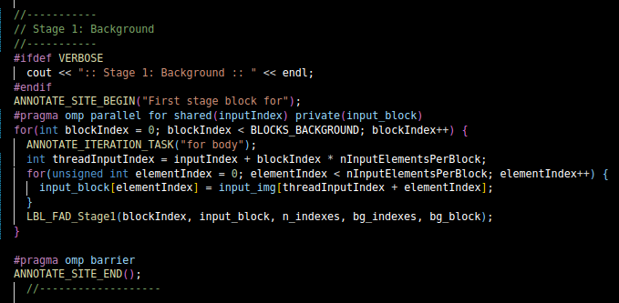
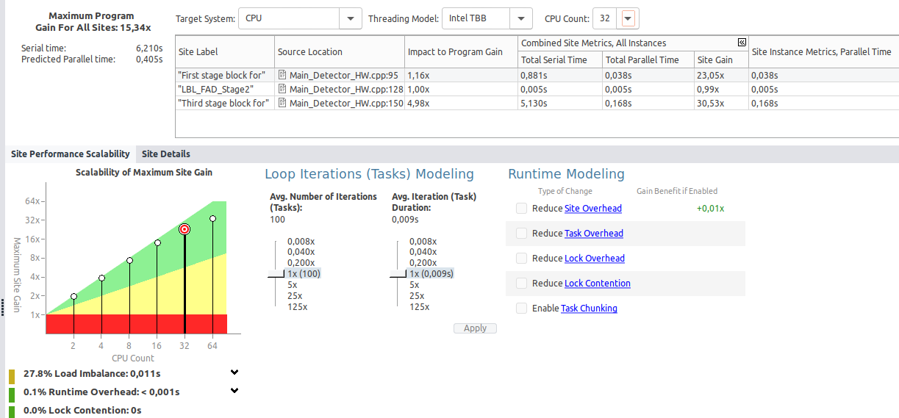
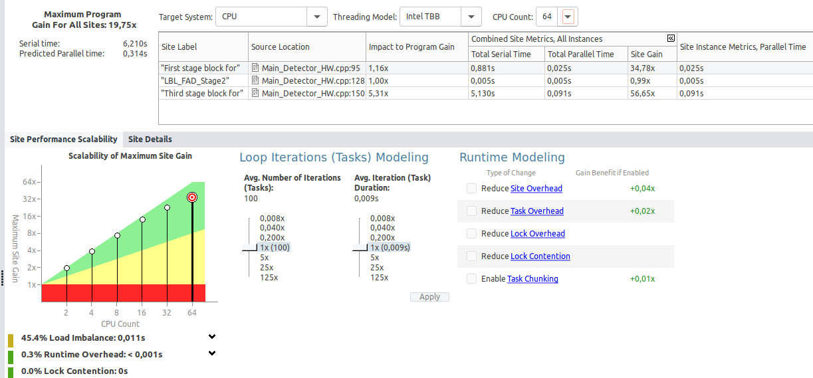

# Paralelización con OpenMP

En base al análisis realizado en las dos tareas anteriores es momento de realizar las paralelizaciones que consideres oportunas en el código.

Para cada paralelización completa la siguiente plantilla de resultados:

## Paralelización 3 bloques Juntos suitable

### Análisis previo

-> Tras analizar ambos 3 fragmentos por separado, procedemos a realizarlo los 3 de forma conjunta

### Paralelización

* Aquí Se muestran las 3 diferentes paralelizaciones juntas que he realizado.

### Análisis posterior
Compara el código original con el mejorado y realiza tablas de comparación aumentando el número de hilos.

* ¿Coinciden los resultados con el valor predecido por la herramienta?

    * Los resultados esperados generados por advisor coinciden de forma que los valores predichos por advisor se asemejean a los obtenidos. La mejora en el tiempo de ejecución es notable

* ¿Cómo has comparado los resultados para verificar la correción del programa paralelo?

    * Los resultados se verificaron comparando los tiempos de ejecución entre la versión paralelizada y la no paralelizada. Además, se realizaron pruebas con diferentes números de hilos (32, 16, 64) para comprobar que el rendimiento se incrementa conforme se aumenta la cantidad de hilos, sin pérdidas significativas de tiempo

### Resultados
-----
* Comprobamos como nuestra paralelización ha sido correcta, dado que el serial time de nuestro programa sin paralelizar es de 15,045 segundos y que espera un tiepo de 9,183 segundos y cuenta con una ganancia maxima de el programa de 1,64 x.
* Pero una vez paralelizamos nuestro programa nos dadmos cuenta que hemos superado ese límite, dando lugar a un tiempo de 6,210 segundos y una ganacia maxima para todo el programa de 15,34 x

* Puesto que ambos 3 por separado están obteniendo los mismos resultados, su explicación se encontraria en los distintos 'RESPUESTAS.md'

### Capturas todos los resultados:
-----
### Hilos: 32

#### Sin Mejora (Mirar valores, no grafica de abajo)

#### Con Mejora

-----
### Hilos: 16

#### Sin mejora (Mirar valores, no grafica de abajo)

#### Con mejora

----
### Hilos: 64

#### Sin mejora (Mirar valores, no grafica de abajo)

#### Con mejora

-------
### Conclusión:
 * La paralelización mediante OpenMP ha logrado una mejora significativa en los tiempos de ejecución, sobre todo cuando se aumenta el número de hilos. La versión paralelizada del programa muestra una reducción considerable en el tiempo de ejecución, alcanzando una mejora de hasta 15.34x en comparación con la versión secuencial. Por lo que he podido deducir que la paralelización de los 3 bloques puede ser una posible solución.
-----