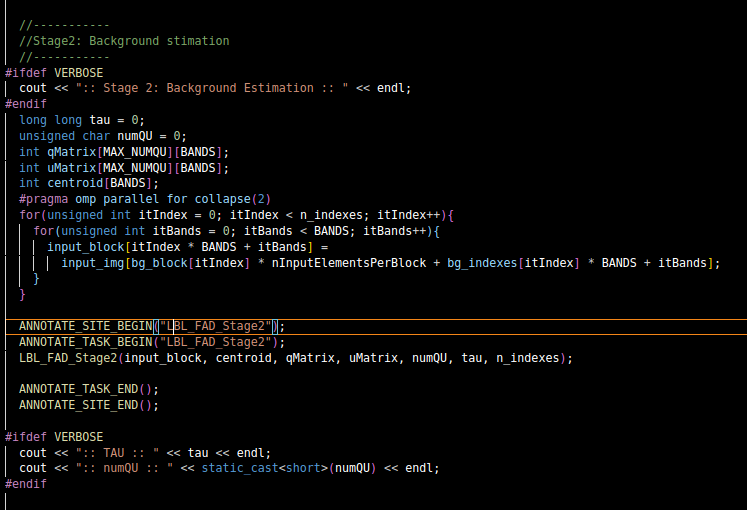
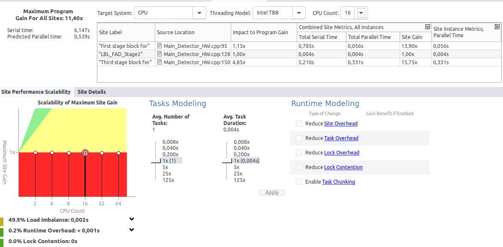

# Paralelización con OpenMP

En base al análisis realizado en las dos tareas anteriores es momento de realizar las paralelizaciones que consideres oportunas en el código.

Para cada paralelización completa la siguiente plantilla de resultados:

## Paralelización LBL_FAD_Stage2

### Análisis previo

-> Dado que este método realiza multiples operaciones dentro de cada iteración independientes entre sí, lo he seleccionado para realizar la paralelización utilizando OpenMP

### Paralelización

¿Has tenido que modificar cómo se calcula alguna variable para evitar dependencias de tipo inter-loop?

* No, daod que la varible input_block se está asignando de forma independiente, por lo que no existen dependencias de tipo 'inter-loop' entre las disitntas iteracciones, por lo que no fue necesario modificar el cálculo de ninguna variable

### Análisis posterior
Compara el código original con el mejorado y realiza tablas de comparación aumentando el número de hilos.

* ¿Coinciden los resultados con el valor predecido por la herramienta?

    * Los resultados que hemos obtenido no genera grandes mejoras, en su caso se mantiene constantemente. Esto puede deberse a que dichas operaciones ya son lo suficientemente rápidas en formato secuencial, por lo que la mejora en la paraleización es prácticamente diminuta.

* ¿Cómo has comparado los resultados para verificar la correción del programa paralelo?

    *Los resultados han sido comparados por medio de los resultados de salida, siendo estos la comparación de los tiempos con la version paralelizada con la no paralelizada. A su vez comparamos dichos resultados, con disitintos hilos para asegurar que nuestra paralelziación resulto corrcta

### Resultados
-----

### Hilos: 32

#### Sin Mejora (Mirar valores, no grafica de abajo)

#### Con Mejora

     Vemos como una vez paralelizado nuestro Fist stage block for, sus valores dismuyen notablemente, lo que nos indica que la paralelización ha ayudado al rendimiento notoriamente, podemos ver una disminución en valores como:

        -Total Serial Time: Se mantiene en 0,004 Segundos
        
        -Total Parallel Time: Se mantiene en 0,004 segundos

        -Site Gain: Se mantiene en 1,00x

        -Site instance Metrics: Se mantiene en 0,004 segundos

-----
### Hilos: 16

#### Sin mejora (Mirar valores, no grafica de abajo)

#### Con mejora

     Vemos como una vez paralelizado nuestro Fist stage block for, sus valores dismuyen notablemente, lo que nos indica que la paralelización ha ayudado al rendimiento notoriamente, podemos ver una disminución en valores como:

        -Total Serial Time: Se mantiene en 0,004 Segundos
        
        -Total Parallel Time: Se mantiene en 0,004 segundos

        -Site Gain: Se mantiene en 1,00x

        -Site instance Metrics: Se mantiene en 0,004 segundos

----
### Hilos: 64

#### Sin mejora (Mirar valores, no grafica de abajo)

#### Con mejora

     Vemos como una vez paralelizado nuestro Fist stage block for, sus valores dismuyen notablemente, lo que nos indica que la paralelización ha ayudado al rendimiento notoriamente, podemos ver una disminución en valores como:

        -Total Serial Time: Se mantiene en 0,004 Segundos
        
        -Total Parallel Time: Se mantiene en 0,004 segundos

        -Site Gain: Se mantiene en 1,00x

        -Site instance Metrics: Se mantiene en 0,004 segundos

#### Explicación para los 3 casos

 * Si comprobamos todos los valores que hemos obtenido, observamos como las diferentes columnas de la tabla se mantienen siempre en el mismo valor, lo que nos puede llegar a entender que la paralelización ha tenido un impacto practicamente invisible en el rendimiento, esto es esperado ya que su tiempo de ejcución secuencial es muy bajo

 * Si observamos los resultado, su tiempo de ejecuión secuencial es muy bajo, por lo que los resultados de la paralelización no se notarian.

### Conclusión

* La paralelización realizada en LBL_FAD_Stage2 no mejoro nada ni empeoro, simplemente se mantuvo en los mismo valores, por lo que los beneficios se están viendo limitados. Se ha probado a paralelizar en los disitntos métodos que utiliza desde la clase 'main' también obteniendo el mismo resultado, osea ninguna mejora, solo se mantiene.
-----

