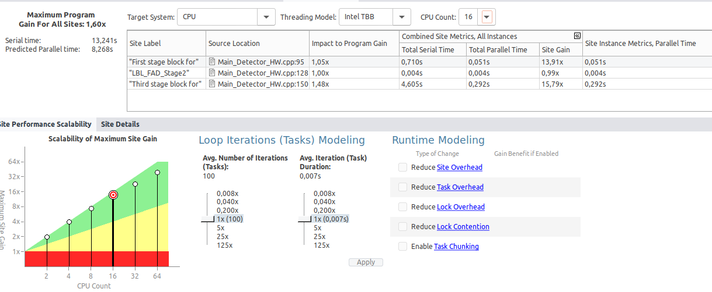

# Paralelización con OpenMP

En base al análisis realizado en las dos tareas anteriores es momento de realizar las paralelizaciones que consideres oportunas en el código.

Para cada paralelización completa la siguiente plantilla de resultados:

## Paralelización LBL_FAD_Stage1

### Análisis previo

-> Dado que este método realiza multiples operaciones dentro de cada iteración independientes entre sí, lo he seleccionado para realizar la paralelización utilizando OpenMP

### Paralelización

- Pragma omp parallel for shared(inputIndex) private(input_block): Permite que el bucle se divida en varias tareas independientes, asignado un hilo diferente para ejeutarse en paralelo

- Pragma omp barrier: Asegura que todos los hilos terminen su tarea antes de que el programa continue

¿Has tenido que modificar cómo se calcula alguna variable para evitar dependencias de tipo inter-loop?

- Si, la varibale InputIndex, dado que en el código sin paralelizar se actualizaba en cada una de las iteraciones del bulce, de esta forma se calcula de forma independiente para cada una de las iteraciones

### Análisis posterior
Compara el código original con el mejorado y realiza tablas de comparación aumentando el número de hilos.

* ¿Coinciden los resultados con el valor predecido por la herramienta?

    *Los resultados obteneidos mediante 'advisor' si coinciden con mis resultados obtenidos

* ¿Cómo has comparado los resultados para verificar la correción del programa paralelo?

    *Los resultados han sido comparados por medio de los resultados de salida, siendo estos la comparación de los tiempos con la version paralelizada con la no paralelizada. A su vez comparamos dichos resultados, con disitintos hilos para asegurar que nuestra paralelziación resulto corrcta

### Resultados
-----

### Hilos: 32

#### Sin Mejora

#### Con Mejora

     Vemos como una vez paralelizado nuestro Fist stage block for, sus valores dismuyen notablemente, lo que nos indica que la paralelización ha ayudado al rendimiento notoriamente, podemos ver una disminución en valores como:

        -Impact To program Gain:  No mejora, se mantiene en el mismo nivel que se encontraba anteriormente sin paralelizar

        -Total Serial Time: Baja de 0,789 a 0,710. Representa el tiempo que tomaría el procesamiento si no se paralelizara, proporcionando una referencia del impacto de la paralelización.
        
        -Total Parallel Time: Baja de 0,035 a 0,031. Indicando un tiempo menor para ejecutar la misma tarea usando múltiples hilos, lo que refleja un aprovechamiento más eficiente de los recursos.

        -Site Gain: Aumenta de 22,83x a 22,87x. Significa que la eficiencia de procesamiento ha mejorado. Este factor compara el tiempo serial con el paralelo, y un aumento en este valor sugiere una mayor ganancia de rendimiento debido a la paralelización.

        -Site instance Metrics: Baja de 0,035s a 0,031s. Sugiere una reducción en el tiempo promedio de procesamiento por instancia, otra indicación de mejora en el rendimiento.

-----
### Hilos: 16

#### Sin mejora

#### Con mejora

     Vemos como una vez paralelizado nuestro Fist stage block for, sus valores dismuyen notablemente, lo que nos indica que la paralelización ha ayudado al rendimiento notoriamente, podemos ver una disminución en valores como:

        -Impact To program Gain:  No mejora, se mantiene en el mismo nivel que se encontraba anteriormente sin paralelizar

        -Total Serial Time: Baja de 0,789 a 0,710. Forma similar al caso con 32 hilos
        
        -Total Parallel Time: Baja de 0,057 a 0,051. Refleja una mejora en el tiempo de ejecución paralelo, aunque no tan significativa como con 32 hilos.

        -Site Gain: Se mantiene de 13,91x a 13.91x. Indica que el aumento de hilos de 16 a 32 aporta mayores beneficios en cuanto a ganancia de rendimiento. Esto sugiere una cierta limitación en el rendimiento adicional al aumentar los hilos a este nivel.

        -Site instance Metrics: Baja de 0,057s a 0,051s . Muestra una mejora en el rendimiento de cada instancia, aunque con menos impacto que en el caso de los 32 hilos

----
### Hilos: 64

#### Sin mejora

#### Con mejora

     Vemos como una vez paralelizado nuestro Fist stage block for, sus valores dismuyen notablemente, lo que nos indica que la paralelización ha ayudado al rendimiento notoriamente, podemos ver una disminución en valores como:

        -Impact To program Gain:  Si mejora, Subiendo un 0,01 respecto al sin paralelizar, suponiendo una mejora

        -Total Serial Time: Baja de 0,789 a 0,710. Consistente con los dos casos anteriores.
        
        -Total Parallel Time: Baja de 0,020 a 0,018. Refleja una notable mejora en la eficiencia al aprovechar un mayor número de hilos.

        -Site Gain: Se mantiene de 39,82x a 39,77x. Ofrece beneficios adicionales en el tiempo de ejecución paralelo, pero también pueden presentarse limitaciones de escalabilidad debido a la sobrecarga de gestión de hilos

        -Site instance Metrics: Baja de 0,020s a 0,018s. Ofrece una mejora en el rendimiento promedio por instancia, aunque este tipo de reducción esmejor en comparación con 16 y 32 hilos.
### Conclusión

-> Tras paralelizar LBL_FAD_Stage1 demostramos como es efectiva, dado que mejora el rendimiento del código, aproveechando la indepedencia de cada operacion en cada iteración. hemos de destacar varias puntualidades:

    * Reducimos el timpo de ejecución Paralelo: Observamos un uso eficiente de los recursos del sistema.

    * Incremento de 'Site 'Gain': Aunque dicho incremneto se nota más cuando utilizamos más hilos, todos mucestran una mejora

    * Escalabilidad : A medida que aumentamos el número de hilos los beneficios se reducen, indicando una limitacion relaccionado con el número de hilos
-----

