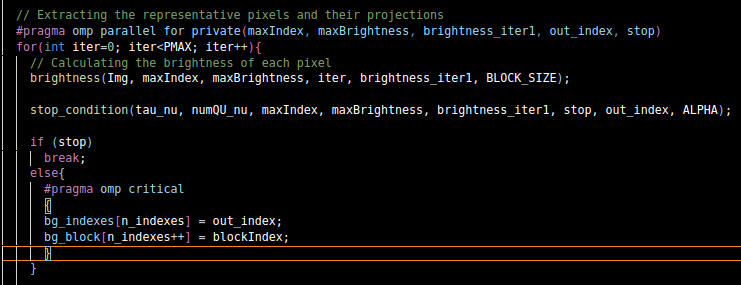

# Paralelización con OpenMP RESPUESTAS

En base al análisis realizado en las dos tareas anteriores es momento de realizar las paralelizaciones que consideres oportunas en el código.

Para cada paralelización completa la siguiente plantilla de resultados:

    -> Para la realización de 'Task3' he realizado una copia de nuestro código con distintos nombre, para evitar modificar el código funete y tener dos ejecutables cumpletamente diferentes y así poder ejecutar uno u otro indistintamente

        *Nuevo ejecutable: src/LBL_FAD_Transform_Operations_parallel.cpp

        *Nuevo .cpp: src/LBL_FAD_Transform_Operations_parallel.cpp

## Paralelización 1: LBL_FAD_Stage1 Erroneo
### Análisis previo

    -> Dado que este método realiza multiples operaciones dentro de cada iteración independientes entre sí, lo he seleccionado para realizar la paralelización utilizando OpenMP

### Paralelización

    -> Para la paralelización de este método, he utizado dos Pragmas como se ve en la Captura de Pantalla:

        -#Pragma omp parallel for: Utilizado para generar un grupo de hilos y  dividir el trabajo de las iteraciones entre esos hilos generados. Cada uno de los hilos recoge un grupo de iteraciones, lo que permite que trabajen de forma paralela

        #Pragma omp critical: utilizado para generar una sección crítica, es decir, un bloque solo puede ser ejecutado por un solo hilo a la vez, lo que nos evita que se produzcan condiciones de carrera

### Análisis posterior

### Hilos: 32

    Compara el código original con el mejorado y realiza tablas de comparación aumentando el número de hilos.

* Sin mejora

* Con mejora

    * ¿Coinciden los resultados con el valor predecido por la herramienta?
        -> Dado que como comprobamos en la Imagen sin paralelización, nos lleva un 'Serial Time' de 15,045 s

        -> Dado que como comprobamos en la Imagen con paralelización, nos lleva un 'Serial Time' de 9,183 s

        -> Advisor, nos indica que la ganancia máxima posible es de 1,64x. Lo cual nos indica que la mejora no es consistente, dado que se no asemeja con los resultados de  Advisor
        
    * ¿Cómo has comparado los resultados para verificar la correción del programa paralelo?

        -> Tras observar el paso de 15,045 s sin paralelización a 9,183 s con paralelización, observamos una mejora significativa en el tiempo al paso de sin paralelización a con paralelización
# ----------------------------------

### Hilos: 64

    Compara el código original con el mejorado y realiza tablas de comparación aumentando el número de hilos.
    
* Sin mejora

* Con mejora

    * ¿Coinciden los resultados con el valor predecido por la herramienta?

        -> Dado que como comprobamos en la Imagen sin paralelización, nos lleva un 'Serial Time' de 5.692 s

        -> Dado que como comprobamos en la Imagen con paralelización, nos lleva un 'Serial Time' de 15.045 s

        -> Advisor, nos indica que la ganancia máxima posible es de 1,66x. Lo cual nos indica que la mejora no se enccuentra fuera  de los valores esperados, dado que no se asemeja con lo esperado de advisor, el cual espera un tiempo de menor
        
    * ¿Cómo has comparado los resultados para verificar la correción del programa paralelo?

        -> He recogido los valores tanto del no paralelizado y del paralelizado, recogemos sus tiempos de ejecución y su comparación a de acercarse a la ganancia que precide Advisor, lo que nos indica que para este caso si se nos aproxima

### Resultados
Por cada mejora guarda los resultados y el código junto a su makefile en results/task3/vX donde X indica el orden en que has paralelizado.

Cada carpeta de resultados tiene que ser ejecutable, es decir, el profesor podrá realizar un make y make run en dichas carpetas
para comprobar cada mejora parcial.

# ----------------------------------

### Hilos: 16

    Compara el código original con el mejorado y realiza tablas de comparación aumentando el número de hilos.
    
* Sin mejora

* Con mejora

    * ¿Coinciden los resultados con el valor predecido por la herramienta?

        -> Dado que como comprobamos en la Imagen sin paralelización, nos lleva un 'Serial Time' de 15,045 s

        -> Dado que como comprobamos en la Imagen con paralelización, nos lleva un 'Serial Time' de 9,0885 s

        -> Advisor, nos indica que la ganancia máxima posible es de 1,66x. Lo cual nos indica que la mejora se no enccuentra dentro de los valores esperados, dado que se no asemeja con la Advisor
        
    * ¿Cómo has comparado los resultados para verificar la correción del programa paralelo?

        -> He recogido los valores tanto del no paralelizado y del paralelizado, recogemos sus tiempos de ejecución y su comparación a de acercarse a la ganancia que precide Advisor, lo que nos indica que para este caso si se nos aproxima

### Resultados
Por cada mejora guarda los resultados y el código junto a su makefile en results/task3/vX donde X indica el orden en que has paralelizado.

# -----------------------------------------------------------------------------
 *Comprobamos como en esta uso paralelizamos en el método interno dando lugar a unos resultados erroneos, esto sucede ya que paralelizamos en el interior del buclo, generando multiples hilos y eliminandolos continuamnete, dado que en el Main, genera hilos entonces paraleliza un hilo y luego otro, dando lugar a una utilziación erronea de la paralelización. Por ello volvemos a probar paralelizando en el Main