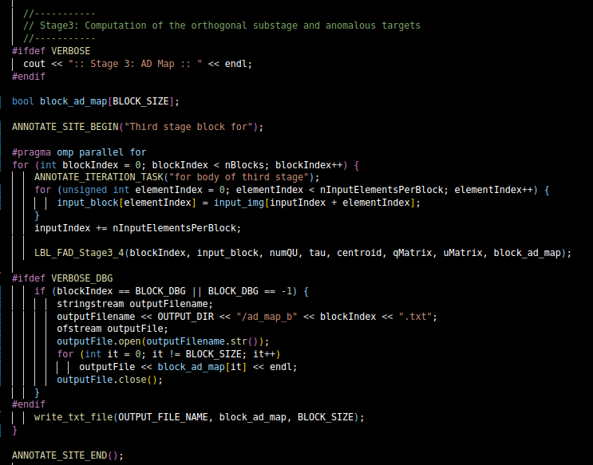
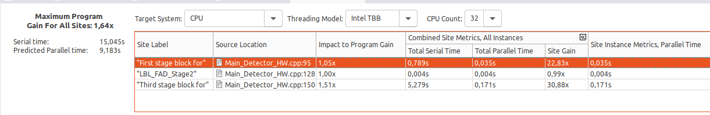
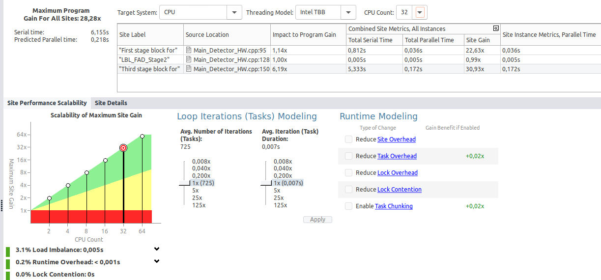
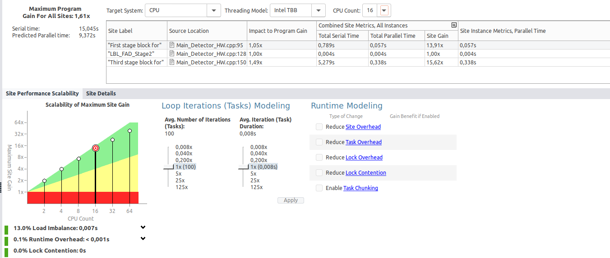
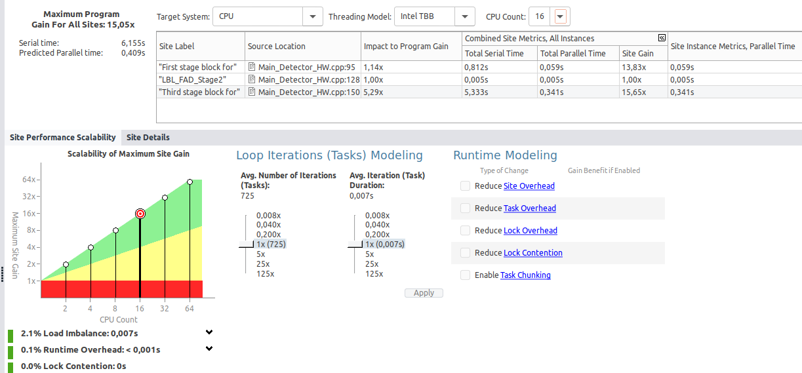
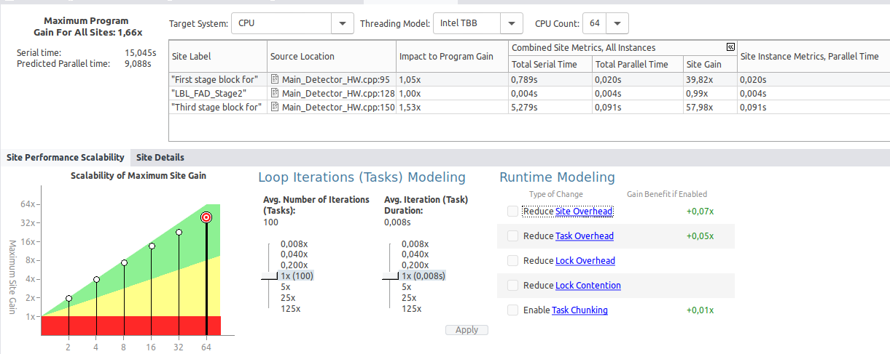
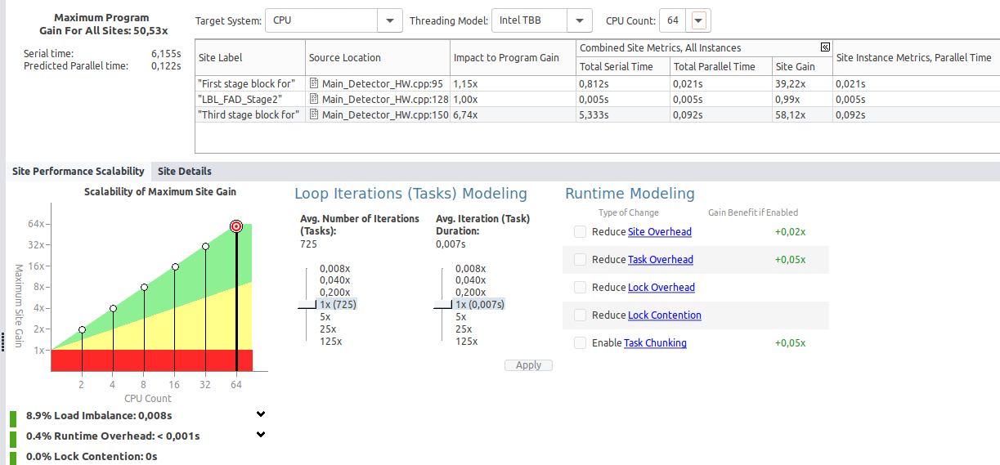

# Paralelización con OpenMP

En base al análisis realizado en las dos tareas anteriores es momento de realizar las paralelizaciones que consideres oportunas en el código.

Para cada paralelización completa la siguiente plantilla de resultados:

## Paralelización Third stage block for

### Análisis previo

-> Dado que este método realiza multiples operaciones dentro de cada iteración independientes entre sí, lo he seleccionado para realizar la paralelización utilizando OpenMP

### Paralelización

- #pragma omp parallel for : indica que los procesos se dividiran entre los disitntos hilos geneados

¿Has tenido que modificar cómo se calcula alguna variable para evitar dependencias de tipo inter-loop?

* No, no he tenido que modificar ninguna de las variables, dado que no tiene dependencias de tipo 'inter-loop'

### Análisis posterior
Compara el código original con el mejorado y realiza tablas de comparación aumentando el número de hilos.

* ¿Coinciden los resultados con el valor predecido por la herramienta?

    *Si coinciden dado que el tiempo que espera advisor una vez paralelizado, se asemeja a el tiempo obtenido una vez paralelizado nuestro código.
    Por lo que podriamos deducir que si coinciden los resultados

* ¿Cómo has comparado los resultados para verificar la correción del programa paralelo?

    *Los resultados han sido comparados por medio de los resultados de salida, siendo estos la comparación de los tiempos con la version paralelizada con la no paralelizada. A su vez comparamos dichos resultados, con disitintos hilos para asegurar que nuestra paralelziación resulto corrcta

### Resultados
-----

### Hilos: 32

#### Sin Mejora (Mirar valores, no grafica de abajo)

#### Con Mejora

     * Vemos como una vez paralelizado nuestro Fist stage block for, sus valores dismuyen notablemente, lo que nos indica que la paralelización ha ayudado al rendimiento notoriamente, podemos ver una disminución en valores como:

        -Impact to Program Gain: Aumenta de un 1,51 a un 6,19x, lo que nos esta indicando una ganancia significativa

        -Total Serial Time: Sube de 5,279s a 5,333s 
        
        -Total Parallel Time: Sube de 0,171 a 0,172

        -Site Gain: Aumenta de 30,88x a 30,83x.

        -Site instance Metrics: Sube de 0,171s a 0,172s.

        -Hemos de tener en ceunta que el serial Time Sin paralelizar era de 15,045 y ahora al paralelizar es de 6,155

    * Observamos como a pesar de una pequeña subidsa tel tiempo de ejecución total, la paralelización muestra una ganancia del programa

-----
### Hilos: 16

#### Sin mejora (Mirar valores, no grafica de abajo)

#### Con mejora

    * Vemos como una vez paralelizado nuestro Fist stage block for, sus valores dismuyen notablemente, lo que nos indica que la paralelización ha ayudado al rendimiento notoriamente, podemos ver una disminución en valores como:

        -Impact to Program Gain: Aumenta de un 1,49 a un 5.29x, mostrando una mejora notable en el rendimiento de programa al paralelizar

        -Total Serial Time: Sube de 5.279s a 5,333s , esto se puede deber a el 'overhead', el cual se asocia a la configuración de la paralelización
        
        -Total Parallel Time: Sube de 0,338 a 0,341

        -Site Gain: Aumenta de 15,62x a 15,65x, a penas se modifica, La diferencia es menor que en 32 hilos, debido a la reducción del número de hilos

        -Site instance Metrics: Sube de 0,338s a 0,341s.

        - Hemos de tener en ceunta que el serial Time Sin paralelizar era de 15,045 y ahora al paralelizar es de 6,155

    * Con 16 hilos, la paralelización sigue mostrando mejoras, aunque con una ganancia menor comparada con 32 hilos

----
### Hilos: 64

#### Sin mejora (Mirar valores, no grafica de abajo)

#### Con mejora

    * Vemos como una vez paralelizado nuestro Fist stage block for, sus valores dismuyen notablemente, lo que nos indica que la paralelización ha ayudado al rendimiento notoriamente, podemos ver una disminución en valores como:

        -Impact to Program Gain: Aumenta de un 1,53x a un 6,74x, supone el mayor incremento, dado que el aprovechamiento de los hilos esta siendo bueno, por lo que notamos una mejora significativa

        -Total Serial Time: Sube de 5,279s a 5,333s , igual al resto de tamño de hilos
        
        -Total Parallel Time: Sube de 0,091s a 0,092s

        -Site Gain: Aumenta de 57,98x a 58,12x.

        -Site instance Metrics: Sube de 0,091s a 0,092s.

        -Hemos de tener en cuenta que el serial Time Sin paralelizar era de 15,045 y ahora al paralelizar es de 6,155

    * Con 64 hilos, la paralelización muestra una ganancia aún mayor, con un aumento significativo en la ganancia del programa. SIn embargo, hemos de tener en cuenta que al poner tantoss hilos, podemos sufrid 'overhead'
-------
### Conclusión:
 * Tras paralelizar elfragmento de código notamos como mostramos mejoras bastante notables, lo que nos indica que la paralelización es adecuada para este código. Todo esto lo notamos en distintos aspectos como la reducción deel tiempo serial global.

 * También podemos tener problemas al aumentar demasiado el número de hilos, dado que al incrementar tanto el número de hilos puede suponer una sobrecarga, para obtener un mayor beneficio en los resultados.
-----