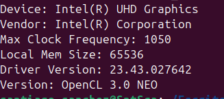

# Tarea 1
Familiarizarse con el uso de DPC.
En primer lugar copia el código de [src/task1/query.cpp](../../src/task1/query.cpp) en results/task1/src y compilalo con dpcpp.

## ¿Qué salida obtienes?
**Contesta aquí.**
En primer lugar para compilar query.cpp, ha sido necesario utilizar el comando : 'icpx -fsycl query.cpp -o query', dando lugar a una salida tras su ejecución de:

    -> Device: Intel(R) Core(TM) i5-10300H CPU @ 2.50GHz

## ¿Qué tipos de selectores tenemos en DPC? ¿Podemos obtener una GPU? ¿Qué pasa si no existe el dispositivo requerido?
**Contesta aquí.**
Tras eleborando la acción gpu_selector ofreciendonos un resultado de:

    -> Device: Intel(R) UHD Graphics

Es probable que alguno de los dispositivos que te permite seleccionar DPC no los tengas disponibles en tu PC. En ese caso habría que recurrir a buscarlos en otros equipos o emplear soluciones de hardware a través de la nube.

## Prueba a obtener una GPU, si es posible en tu equipo, modificando el programa query.cpp en gpu_query.cpp
**guarda el fichero en results/task1/src.**

## ¿Cómo has obtenido la GPU?

La GPU la he obtendio mediante el desarrollo de el código gpy_query.cpp en el cual seleccionando la gpu del ordenador en el que elaboramos las prácticas.

## Modifica el programa para obtener más datos del dispositivo.
**guarda el fichero en results/task1/src/more_query.cpp**
* Para obtener un mayor número de datos del dispositivo utilizamos disitintas codificaciones especificados en [Modified_query.cpp], ofreciendonos un resultado de:

------
# Task 1
Get familiar with Intel DPC compiler.
First copy the code in [src/task1/query.cpp](../../src/task1/query.cpp) to results/task1/src and compile it with dpcpp.

## Which output do you obtain?
**Answer here**

## Which different types of selectors do we have in DPC? Can we obtain a GPU? What happens if the requested device doesn't exist?
**Asnwer here**

It is very likely that some of the devices that can be used with DPC are not available in your PC. In that case, we would look for them in other equipment or use hardware solutions through the cloud.

## Try to obtain a GPU, if it is available in your PC, by the query.cpp program into gpu_query.cpp
**store the resulting file in results/task1/src.**

## How did you obtained the GPU?
**Answer here**

## Modify the program to obtain more data from the device.
**store the resulting file in results/task1/src/more_query.cpp**
