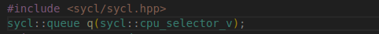
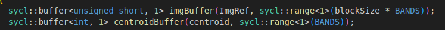
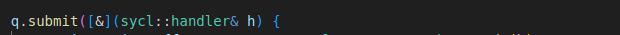
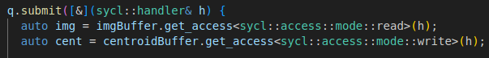
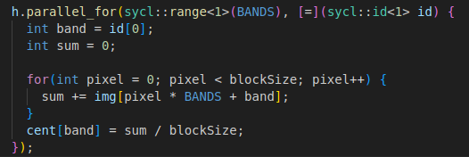
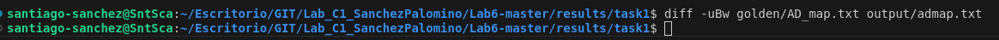
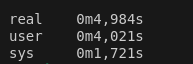

# Tarea 1
En esta tarea paralelizarás parte del código con DPC, en concreto deberás traducir a DPC la operación centroide (averagePixel).
Luego, en la siguiente tarea deberás realizar este mismo trabajo con las otras operaciones.

## Preparar el código
Al igual que con la práctica de DPC deberás descargar el fichero stimuli.bin y ponerlo en el mismo directorio que el ejecutable que generes tras realizar la compilación. El fichero se puede descargar, junto a los ficheros golden y los papers asociados al código desde el siguiente [enlace](https://mega.nz/folder/x4gRhLJJ#GRdxQc1Hnw3Lk_-9JC3Uew).

Recuerda que en esta práctica **no realizaremos la paralelización a nivel de bloque**, sino que paralelizaremos las diferentes operaciones convirtiéndolas en kernels (centroid, brightness, averagePixel...)

## Preparación
>En Primer lugar para conseguir compliar mediante la función Make con las funciones SYCL, me supuso una modificación del MakeFile, dado que si no, me era imposible ejecturar dicha directiva, los cmabios realizados han sido:

> CPPFLAGS += -I/opt/intel/oneapi/compiler/latest/include -I/opt/intel/oneapi/vtune/latest/include -I/opt/intel/oneapi/advisor/latest/include

**Tiempo Inicial**

## Crea la cola y un selector de dispositivo por defecto

>En primer lugar importamos la libreria necesaria para poder utilizar la tecnología de sycl

>Inicializamos nuestra  cola con nombre 'q'

## ¿Para que sirve la cola?

> Una cola en SYCL, es un mecanismo que se encarga de enviar las tareas a el dispositivo seleccionado (CPU,GPU,...). Este funciona como si fuese un administrador de tareas, el cual permite organizar y enviar las tareas a el disposicitvo de forma asincrona. Sin olvidarnos de que una cola controla la sincronización y nos asegura que los datos puedan ser indexados en el momento correcto. El uso de una cola puede reducir la carga de generación de colas redundnates, permitiendonos sacar el máximo rendimiento a los recursos del dispositivo.

>Para resumir, una cola es un actuador intermediario entre el código host y el código.  Los trabajos no se ejecutan directamente, si no que se encolar hasta ser procesador en el dispositivo cuando esté disponible.

## Para cada array crea sus buffer correspondientes

>Para la Generación de buffers podemos de realizarlo de la forma que vemos en la imagen.

>Generamos buffers para ImgRef y para centroid

>Definimos el range del espacio por medio de 'Range'

## Manda una tarea a la cola

>Las tareas a la cola son enviadas por medio de la instrucción 'submit'.

>Declaramos los accesors a cada uno de los buffers.

>Definimos el Kernel paralelo con 'parallel for'

## Solicitar acceso a los buffer
Recuerda que hemos creado los buffer para abstraer el acceso a las diferentes variables. Tal y como se ha visto en teoría hay que solicitar el acceso a cada buffer por medio de los accessors. **En las primeras líneas dentro de la cola** define los accessor que necesitamos.

## Crea el parallel_for
Ahora que ya tenemos acceso a cada uno de los buffer, hay que solicitar por medio del handler el parallel_for indicando: el rango del kernel (revisa los pasos anteriores) y el kernel. Inicialmente deja el kernel vacio y comprueba que la compilación es correcta.

Una vez finalizado el parallel_for (recuerda añadir el código del cálculo del centroide en el kernel), compila el código y asegurate de no tener errores de compilación.

## Esperar al trabajo y acceder a los resultados
Finalmente solo queda esperar a la cola, busca como puedes esperar y acceder mediante un host_accessor al buffer de salida del kernel. Únicamente creando el host_accessor al buffer el runtime se asegura que tienes acceso al mismo y ya puedes acceder como lo harías normalmente.

**Comprueba que el código produce los mismos resultados que el código secuencial**
 Para comprobar que nuestro código una vez paralelizado da el mismo resultado seguimos una secuencia de acciones en terminal:

  >1.- Make run

 >2.- diff -uBw golden/AD_map.txt output/admap.txt
 * En el caso que diff de mensaje de texto por terminal, supone que existen objetos distintos.

 * Adjunto imagen para mostrar que en este caso realiza lo mismo aun después de haber paralizado.
 
 
 * Hemos de tener en cuenta que cada vez que realicemos un 'make run', y posteriormente un diff, si queremos volver a probar, hemos de realizar un 'make clean' para limpiar la salida anterior

 ## Tiempo Obtenido

 > Tras realizar la parelización del centroido utilizo la función 'time' por la cual calculare el tiempo de ejecución del código tras su paralelización:

 
 
> Tras analizar ambos dos tiempos, el inicial y el tiempo tras paralelizar, comprobamos una mejora en el rendimiento respecto a el código inicial (secuencial)
----