# Tarea 2
Paraleliza al menos dos operaciones más además del centroide. Una vez realizadas todas las modificaciones guarda el código en results/task2.
Comprueba que los resultados siguen siendo correctos. Importante, prueba a ejecutar varias veces el programa, algunos errores solo occurren en determinadas ocasiones.
* Para comenzar, a la hora de realizar esta paralelización intentaré obtener el mayor rendimiento del código posible, por ello, tras analizar los métodos restantes que no sean el 'centroide', elegí los dos métodos posteriormente mostrados.

* Para una mejor paralelización, la mejor opción es elegir aquellos métodos que trabajan con mayor número de datos, realizan operaciones con gran valor computacional o sabemos con claridad que podemos obtener un beneficio. 

* He realizado la paralelización de dos operaciones, las cuales han sido:

>    -> projectingImg

>    -> brightnessAD

## ¿Mejora el código paralelo con respecto al código secuencial?
* Para mostrar la mejora de el código paralelo frente al secuencial, optamos por utilizar la herramienta de Intel 'advisor'. En primer lugar, anaizaré la parte secuencial, y del mismo modo analizare el formato paralelo, para posteriormente comparar dichos resultados.

 ### Análisis Código Secuencial
#### Survey & Roofline
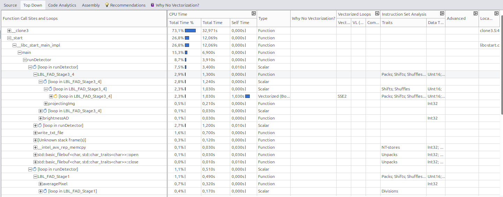
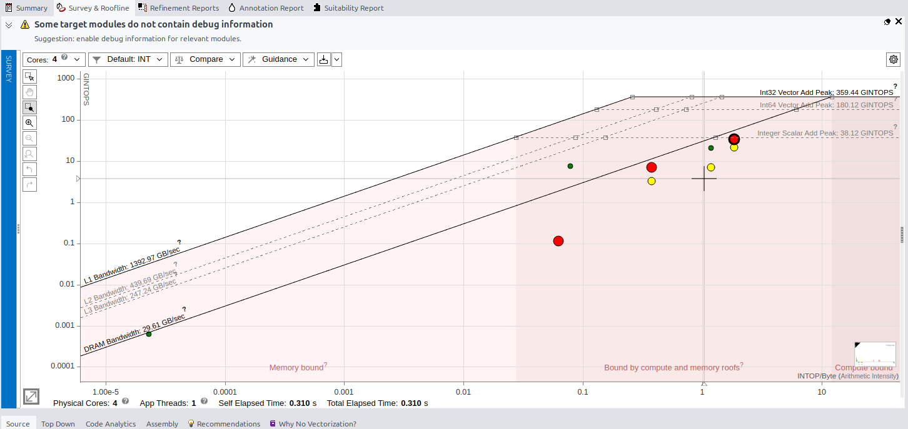
#### Top Time-Consuming Loops
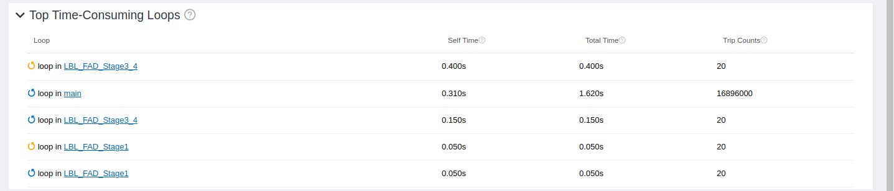

#### Suitability Report

**8 CPU**

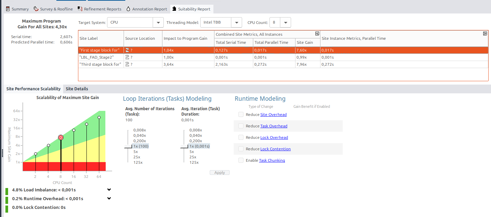

**32 CPU**

**64 CPU**

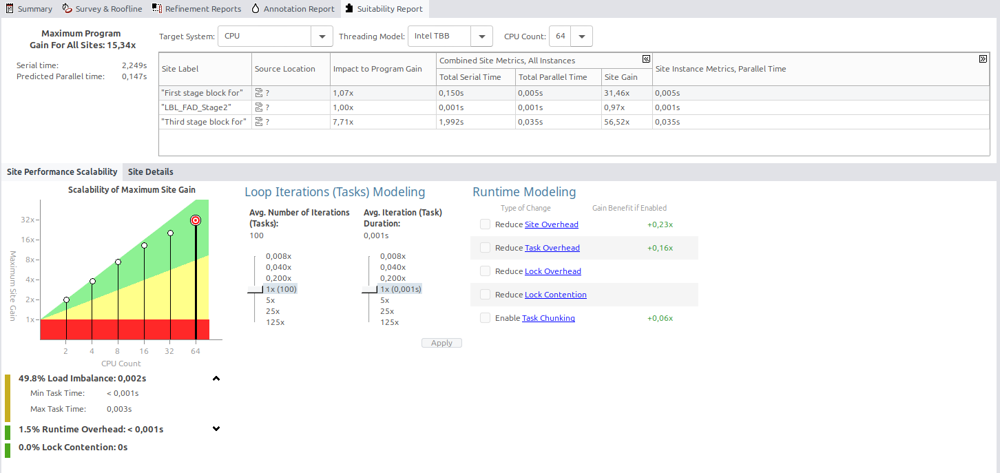

---
> Una vez Mostrados los análisis del código sin paralelizar mediante la aplicación 'advisor-gui', me doy cuenta que este código no cuenta con **vectorización**, por lo que limmita el rendimiento en Hardware. Esto puede ser provacado por las dependencias de los datos o las limitaciones del código.  A su vez, en el gráfico **Roofline** me encuentro con algunos puntos cerca de el límite de 'memory Bound' lo que nos puede indicar que estan siendo limitadas por la velocidad de acceso a memoria. Por otro lado, observamos como en **Suitability Report** al aumentar el número de CPUs, la escalabilidad de nuestro código y su eficiencia disminuyen progresivamente, esto puede ser ocasionado por el aumento en el desequilibrio de a carga y las limitaciones del código.
---
 ### Análisis Código Paralelo
 

 #### Survey & Roofline
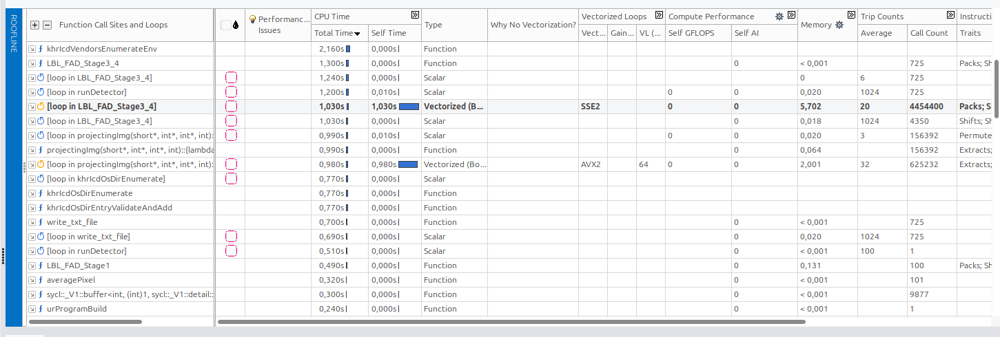
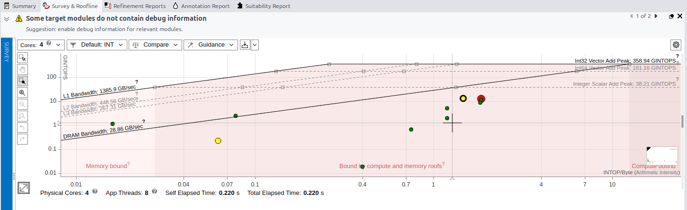

#### Top Time-Consuming Loops
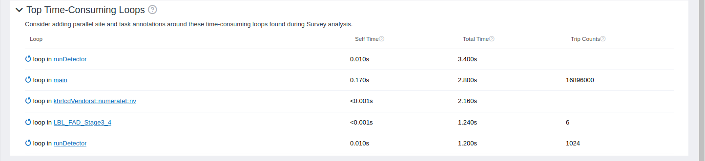

#### Suitability Report
**8 CPU**

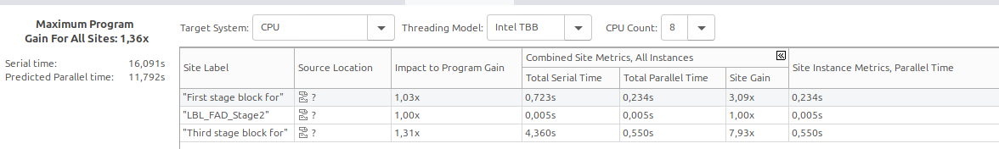

**32 CPU**

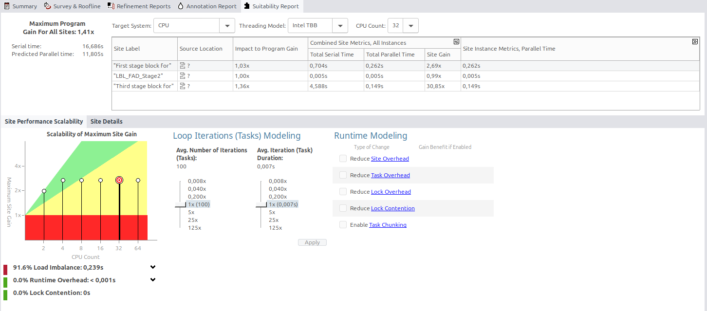

**64 CPU**

#### Top Down

---
> Una vez aplicada la paralelización de los 3 métodos, comprobamos como el código tiene mejoras significativas, en primer lugar **Survey And Roofline** muestra como hace un mejor uso del Harware gracias a la paralelización, lo que supone una disminución de los cuellos de botella en algunas de las funciones, mostrando una mejora en la distribución de estas tareas, a pesar de ello, se mantienen algunas restricciones relaccionadas con la memoria. Por otro lado, en **Suitability Report** analizo la ganancia con distinto número de CPU, obteniendo como a medida que aumentamos el número de CPU el código mejora obteniendo beneficios en el rendimiento al aumentar el número de CPU,
 ---
 ## Conclusión
 > Una vez analizado el código sin paralelizar y el código paralelizado, se muestran cambios significaivos en el rendimiento, a pesar de ello no todas las limitaciones en el códgio han sido elimindas. Por último cabe destacar que algunas de las restricciones relaccionadas con el acceso a memoria y la falta de paralelización en algunos métodos hacen que estas limitaciones sigan presentes.
 ## Contraste de Ambos dos con función 'time'
 * Ambos códigos es dificil de encontrar bajadas de tiempos dado, que nuestros ordenadores no cuentan con la tecnología instalada. Por lo que usaria la CPU por defecto, dando lugar a no conseguir los tiempos esperados.

### Con Funciones paralelizadas:
 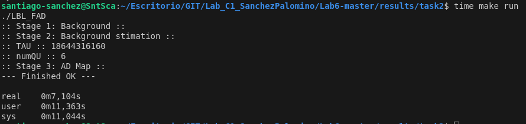

### Con Funciones Secuenciales:
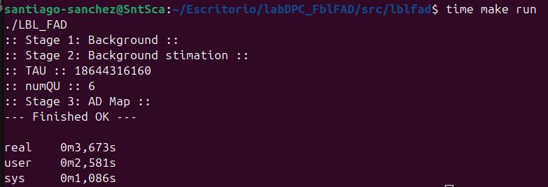

---

## Análisis de los métodos Paralelizados: 

### Método projectingImg
* Este método calcula la proyección de una imagen sobre un vector. Cada uno de los pixeles es independiente.

**¿Por que lo paralelizamos??**
* Este método es paralelizado, ya que realiza multiples multiplicaciones por cada una de las bandas del pixel. Cada pixel seleccionado no cuenta con dependencias con otros, lo que nos facilita la distribución entre los distintos núcleos de la GPU.

### Método brightnessAD
* Este método detecta anomalias en la imagen, es decir, comprar el brillo actual de un pixel con el umbral.

**¿Por que lo paralelizamos??**
* Este método es paralelizado, cada pixel seleccionado no cuenta con dependencias con otros, lo que nos facilita la distribución entre los distintos núcleos de la GPU. Dentro de el, las operaciones que realiza son multiplicaciones y movimientos de datos (bits).

### **Tiempos obtenidos tras paralelizar**

 

## Conclusiones:

* Una vez paralelizado este código, podemos deducir un conjunto de conclusiones:

> **Tamaño de datos:** Los métodos paralelizados pueden resultar más efectivos a la hora de enfrentearse a conjuntos de datos grandes. Para Problemas pequeños, el coste de inicialización puede superar al coste del paralelismo.

>**Memoria:** La memoria del host suele ser bastante más lenta que la memoria de la GPU, aunque esta puede contar con una mayor latencia. Esto sucede siempre y cuando los datos se encuentren organizados de forma correcta.

>**Diferencias Hardware:** Tras analizar los resultados, comprobamos como la GPU y la CPU, son dispositivos difrentes, dado que una GPU de alta gama puede llegar a ofrecer mejoras respecto a una CPU.
---
## Comprobación resultados
 **Comprueba que el código produce los mismos resultados que el código secuencial**

 Para comprobar que nuestro código una vez paralelizado da el mismo resultado seguimos una secuencia de acciones en terminal:

 > 1.- Make run

 > 2.- diff -uBw golden/AD_map.txt output/admap.txt
 * En el caso que diff de mensaje de texto por terminal, supone que existen objetos distintos.

 * Adjunto imagen para mostrar que en este caso realiza lo mismo aun después de haber paralizado.

 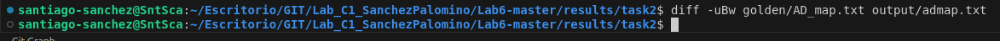

 * Hemos de tener en cuenta que cada vez que realicemos un 'make run', y posteriormente un diff, si queremos volver a probar que los resultados obtenidos son los mismos que tras la paralelización, hemos de realizar un 'make clean' para limpiar la salida anterior y poder comparar la salida deseada.

