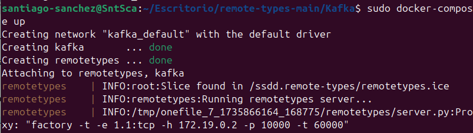
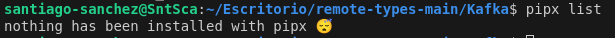
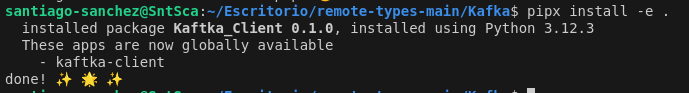
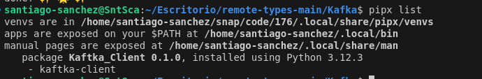
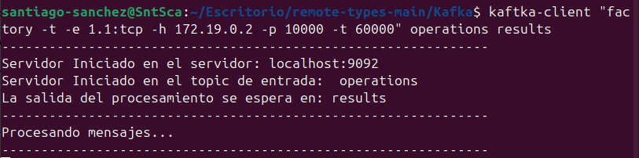

# Sistemas Distribuidos
 * Grupo C
 * Nombre: Santiago Sánchez-Celemín Arévalo

---
# 1 -Iniciar Servidor de Kaftka:
> Dentro de la carpeta Kaftka ejecute en una terminal el comando [sudo docker-compose up] lo que le iniciará la conexión con 'remote types' y la apertura de los diferentes tópics de entrada (operations) y salida (results).[1]

**[1]**

 * Este nos mostrará el proxy necesario para la conexión con remote-types.
---
# 2 -Iniciar procesador de mensajes (Cliente Kaftka)

* Dentro de la carpeta de kaftka realizar el los siguientes comandos:
    * **1.-** Comprobamos que no tenemos ninguno instalado.[2]

     **[2]**
    

     * **2.-** Iniciamos el Cliente de Kaftka mediante docker-compose:[3]

    **[3]**
    

    * **3.-** Comprobamos que la instalacción ha sido correcta.[4]

    **[4]**
    

    * **4.-** Ejecutamos el cliente mediante la estructura:[5]

        * kaftka-client "Proxy remote-types" Topic de Entrada Topic de Salida Server( Este si no lo pone se pondrá por defecto el localhost:9092)

        * Si no pone server se pondrá por defecto el localhost:9092

        **[5]**
        
        
        * Este esperará a recibir un mensaje a través del Topic de Entrada, lo procesara y mandará la solución a el Topic de Salida.

